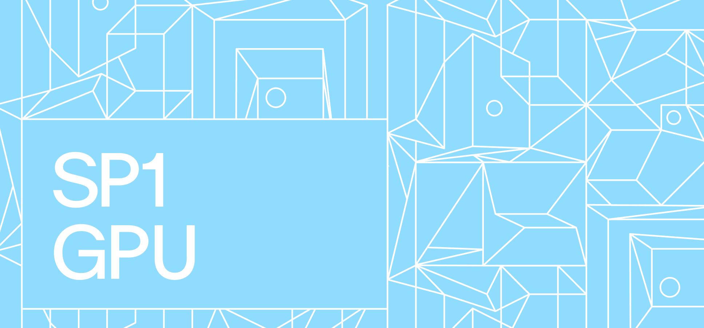

<div align="center">



[![Github Actions][gha-badge]][gha-url] [![Telegram Chat][tg-badge]][tg-url]

The official GPU prover implementation for SP1, written in CUDA.

[gha-badge]: https://img.shields.io/github/actions/workflow/status/succinctlabs/sp1-gpu/docker.yml?branch=main
[gha-url]: https://github.com/succinctlabs/sp1-gpu/actions/docker.yml
[tg-badge]: https://img.shields.io/endpoint?color=neon&logo=telegram&label=chat&url=https%3A%2F%2Ftg.sumanjay.workers.dev%2F%2BAzG4ws-kD24yMGYx
[tg-url]: https://t.me/+AzG4ws-kD24yMGYx
</div>

## Profiling

### Jaeger

Setup Jaeger:
```
sudo docker run -it --rm -d -p4318:4318 -p4317:4317 -p16686:16686 jaegertracing/all-in-one:latest
```

Run a benchmark:
```
RUST_LOG=debug cargo run --release -p moongate-perf -- --program fibonacci
```

### Nvidia Nsight Systems

Run a benchmark:
```
RUST_LOG="debug" nsys profile --trace=cuda,nvtx cargo run --release -p moongate-perf -- --program fibonacci --trace nvtx 
```

## Server

Build the server image:
```
sudo docker build -f Dockerfile.server -t moongate-server .
```

```
DOCKER_BUILDKIT=1 docker build -f Dockerfile.server -t jtguibas/sp1-gpu:v4.0.0-rc1 --ssh default=${SSH_AGENT_AUTH_SOCK} .
```

Run the server:
```
sudo docker run -e "RUST_LOG=debug" -p 3000:3000 --rm --runtime=nvidia --gpus all moongate-server
```

## Docker Images

Our Docker images are automatically built and pushed to Amazon ECR Public using GitHub Actions. The process is defined in the `.github/workflows/docker.yml` file.

### Build and Release Process

1. The Docker image is built on every push to the `main` branch and for all pull requests targeting the `main` branch.
2. The image is always tagged with the Git commit SHA.
3. If the commit has a Git tag:
   - An additional image is pushed with that tag.
   - The image is also tagged as `latest`.

### Accessing the Images

You can browse and pull our Docker images from the Amazon ECR Public Gallery:

https://gallery.ecr.aws/succinct-labs/sp1-gpu

To pull the latest tagged release:

```
docker pull public.ecr.aws/succinct-labs/sp1-gpu:latest
```

To pull a specific version (replace `<tag>` with the desired version):

```
docker pull public.ecr.aws/succinct-labs/sp1-gpu:<tag>
```
